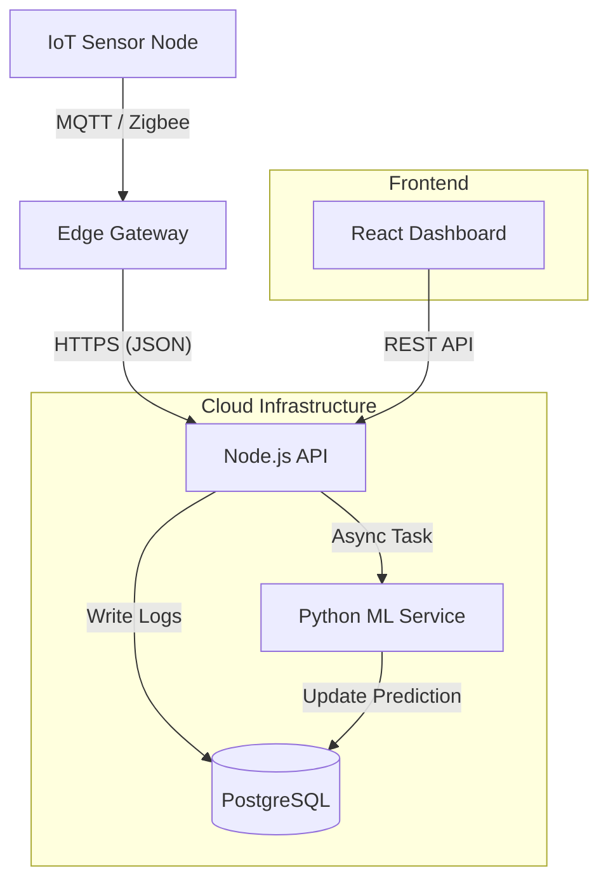

2. Architecture Trade-offs
Monolith vs. Microservices Architecture

Decision: I chose a Modular Monolith.

Trade-off: We sacrifice independent scaling of services for development speed and simplicity.

Reasoning: Microservices introduce complex networking and deployment challenges that would slow down interns. A monolith allows us to run the entire backend locally with one command, making debugging easier for junior engineers.

Single Database (PostgreSQL) vs. Polyglot Persistence

Decision: I chose PostgreSQL as the single source of truth.

Trade-off: A dedicated Time-Series Database (like InfluxDB) would be more performant for high-frequency IoT logs.

Reasoning: Managing two databases increases DevOps overhead. PostgreSQL is "fast enough" for our current scale and handles both relational data (Users) and unstructured JSON logs (Sensor Data) effectively.

Asynchronous ML Worker vs. Real-time Inference

Decision: The ML prediction runs as a separate background worker.

Trade-off: We accept a delay of a few seconds for predictions rather than getting them instantly.

Reasoning: Running heavy ML computations inside the main API thread could block the event loop and crash the dashboard. Isolating it ensures the Ops Dashboard remains responsive even if the ML model hangs.

3. Tech Stack Justification
Frontend: React + Tailwind CSS

Why? (Intern Speed): The ecosystem is massive. Interns can use pre-built UI component libraries rather than struggling with custom CSS. React's component-based structure forces modularity, preventing "spaghetti code."

Backend: Node.js + TypeScript

Why? (Safety): TypeScript is non-negotiable for this team. It catches common errors (like accessing missing properties) at compile time. This acts as a safety net, preventing interns from shipping simple bugs to production.

Database: PostgreSQL

Why? (Simplicity): It supports JSONB, allowing us to store "messy" sensor data without needing a separate NoSQL database. This keeps our infrastructure boring and reliable.

ML Pipeline: Python

Why? (Standardization): Python is the industry standard for Data Science. We run it as a standalone service so the ML intern can work in their native environment without needing to learn JavaScript/Node.js.

Hosting: Render / Railway

Why? (Zero Ops): As a Founding Engineer, I want to focus on code, not server management. These platforms offer "Git-Push-to-Deploy," allowing interns to deploy their own preview environments easily

